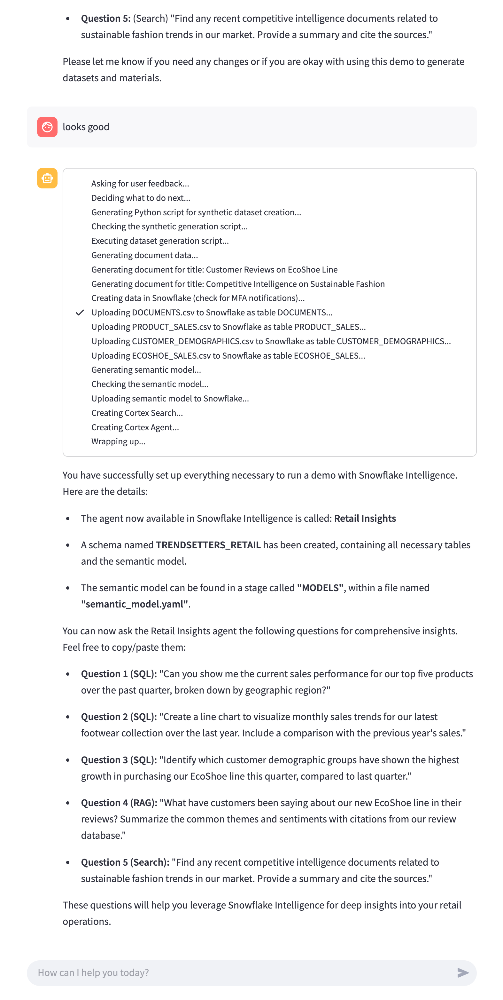

# Agent Demo Creator

An Agent of Agents. This is a LangGraph agent that will help come up with an idea for a demo of Snowflake Intelligence, generate all the necessary data required to power the demo, create the necessary semantic models / search services, and register it in a Snowflake Account.



## Information

Based on my own usage I'd say 70% of the time it works perfectly with all valid artifacts and a working demo. When it fails, it almost always fails because the semantic model it generates is invalid. You can either open up the schema it creates and find the MODELS folder to try to fix the semantic model yourself (for instance, using the Snowflake Cortex Studio analyst UI), or you can see the semantic model in your file structure called `semantic_model.yaml` and try to fix and then replace the model in the stage.

You may also notice some of the questions it built data to answer the Agent may not answer as intended. But it gives you a good starting point.

## Setup

*This assumes you already have an account with Snowflake Intelligence and the setup steps completed (e.g. there is a `SNOWFLAKE_INTELLIGENCE.AGENTS.CONFIG` table in your account).*

1. Clone this repository, and navigate to the folder
2. Create a virtual environment

    ```bash
    python3 -m venv venv
    source venv/bin/activate
    ```
3. Install the requirements

    ```bash
    pip install -r requirements.txt
    ```

5. Create a database in your Snowflake account the agent can create schemas / datasets in. For example:

    ```sql
    CREATE DATABASE SNOWFLAKE_INTELLIGENCE_DEMOS;
    ```

4. Make sure you have Snowflake configuration file with a connection set for it to connect to. This should be in `~/.snowflake/config.toml`. The role will need to have permission to create tables, cortex search services, and add config to `snowflake_intelligence.agents.config`. For example:

    ```toml
    [connections.agent-creator]
    account = "<your-account>"
    user = "<your-username>"
    authenticator = "externalbrowser"
    database = "SNOWFLAKE_INTELLIGENCE_DEMOS"
    warehouse = "SNOWFLAKE_INTELLIGENCE_WH"
    role = "ACCOUNTADMIN"
    ```

5. Rename `.env.sample` to `.env` and replace the values with the right values for your environment.

6. Run the Streamlit UI

    ```bash
    streamlit run streamlit/app.py
    ```
